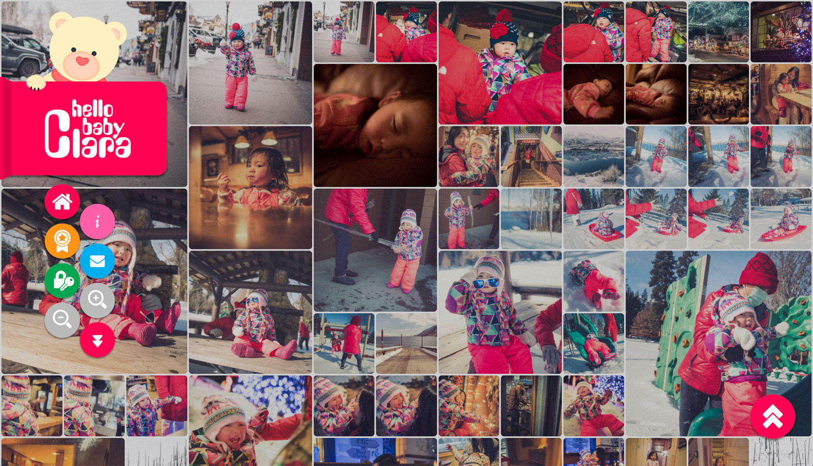
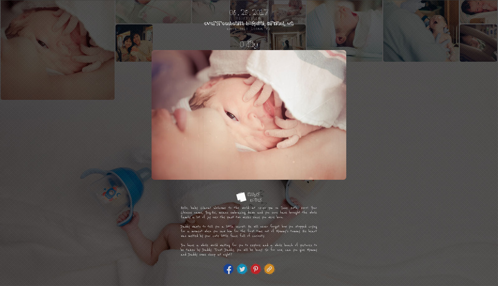
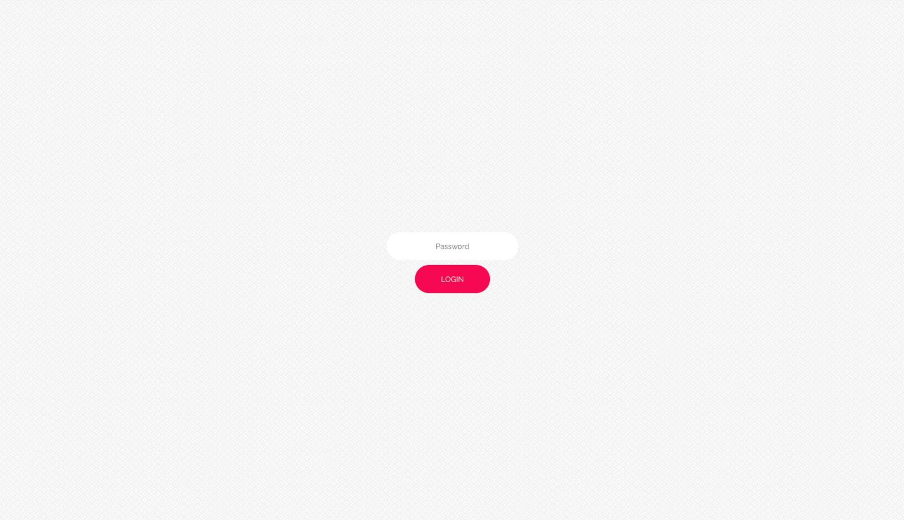
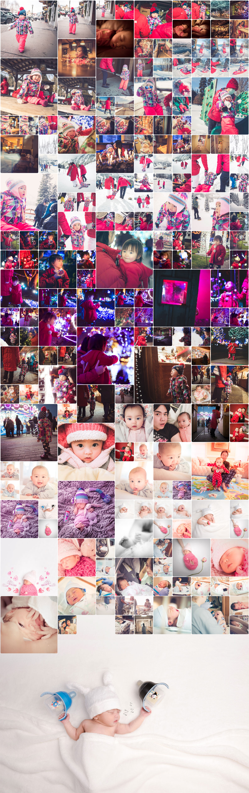
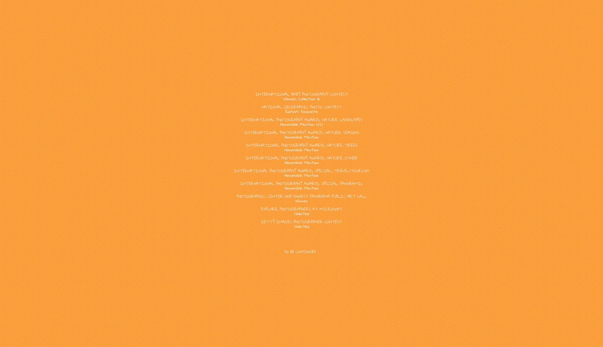

# Hello Baby Clara!  
**v0.8.3**

**Tech Stack:** PHP, JavaScript, jQuery, HTML5, CSS

## Description
Before data science I was a software engineer. To this date, I continue to enjoy working on web development projects at my own free time. *Hello Baby Clara!* is an interactive web experience that I created to document my daughter's growth since 2017. The website is functional but currently in development with performance latency issues to be resolved:

https://yintrigue.com/hellobabyclara/

Technically speaking, *Hello Baby Clara!* is a single-page web application designed for storytelling using photos and text diaries. Key features include:

- Layout is dynamically generated and fully responsive.
- Layout can be zoomed in/out for an optimal browsing experience.
- Photos and diaries are progressively loaded as the page is scrolled down, helping reduce bandwidth despite high-resolution photos.
- No database is required. All contents are loaded/rendered based on directory structure and EXIF tags. The web app can be ported by a simple copy-and-paste.
- User login is supported for viewing private photos and diaries.
- Fun interactive experience with sound effects. This is a project to be enjoyed by both farther and daughter!

Note: *Hello Baby Clara!* is built from the ground up using jQuery and a number of third-party libraries. The reason for not using Angular or React is to avoid design limitation imposed by the frameworks in addition to keeping things simple and flexible. 

## Screenshots
*Hello Baby Clara* is an online photo diary documenting a baby girl's growth!  
 
 
Diary can be entered for each photo and shared on social network.
 
 
User login is supported for viewing private photos and diaries.
 
 
Layout is fully responsive and can be zoomed in/out for a personalized viewing experience.  
 
 
This is a full-page rendering with the default zoom.  
 
 A fun, colorful experience to be enjoyed by both farther and daugther!
 

## Repository 

- `./src` contains all source codes and BLOB assets.
- `./img` contains the images used for the readme markdown.  
- A work-in-progress *Hello Baby Clara!* can be previewed at https://yintrigue.com/hellobabyclara/

