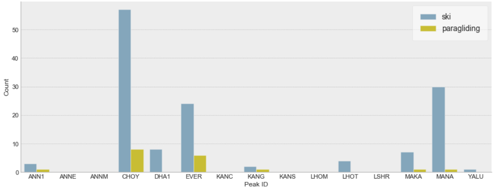

# Death-Zone Mountaineering  
Tech Stack: Plotly, Python

## Description
In mountaineering, the death zone refers to altitudes above 8,000 m (26,000 ft) where the amount of oxygen is insufficient to sustain human life for an extended time span. There are a total of 14 mountains in the death zone (als known as the eight-thousanders) located in the Himalaya and Karakoram mountain ranges. Each year, climbers from all over the world are drawn to the beauty of eight-thousanders and venture into the death zone in attempts to summit the peaks. While many succeed and celebrate the triumph on the top of the world, some unfortunately never return and many more are injured or become ill during the expeditions.  

The project is an analytics research designed to explores the 14 eight-thousanders (with a total of 16 peaks) that are publicly open to climbers with permits in the Himalayas mountain range. The three primary research questions are:

- Who are the people willing to risk their life venturing into the death zone?

- How do mountaineers’ eight-thousander peak preferences change over time?
- What makes climbing eight-thousanders risky?

## Data

The research is primarily based on the [Himalayan Database](https://www.himalayandatabase.com/), which can be best described by the creator’s own words:

*“The Himalayan Database is a compilation of records for all expeditions that have climbed in the Nepal Himalaya. The database is based on the expedition archives of Elizabeth Hawley, a longtime journalist based in Kathmandu, and it is supplemented by information gathered from books, alpine journals and correspondence with Himalayan climbers.”*

Five datasets are included in the Himalayan Database:

| Dataset              | Description                                                  |
| -------------------- | ------------------------------------------------------------ |
| Peaks                | Data of all peaks in the Himalayas                           |
| Expeditions          | Data of all expeditions between 1905 and 2019                |
| Members              | Data of members of each expedition between 1905 and 2019     |
| Expeditions Analysis | Calculated expedition analytics based on the Expeditions dataset |
| References           | References used for constructing the Himalayan Database      |

A copy of the exported raw data and documentation can be found in the repository at `./data`.

## Select Findings
### Homes of the Daredevils

Europe is the origin of mountaineering. Our research, however, shows that in addition to Europe, a large number of eight-thousander climbers come from developed countries including Japan, Korea, and the US, lilkely reflecting the high costs associated with the expeditions.

Figure: Eight-Thousander Climbers’ Home Countries (1905-2019)

### Rise of Girl Power

Mountaineering has historically been dominated by men: Only 1 out of 10 climbers were female between 1905 and 2019. However, there has been a rapid growth of female climbers since 1980.

Figure: Male vs. Female Climbers (1905-2019)&nbsp;&nbsp;&nbsp;&nbsp;&nbsp;&nbsp;&nbsp;&nbsp;&nbsp;&nbsp;&nbsp;&nbsp;&nbsp;&nbsp;&nbsp;&nbsp;&nbsp;&nbsp;&nbsp;&nbsp;&nbsp;&nbsp;&nbsp;&nbsp;&nbsp;&nbsp;&nbsp;&nbsp;&nbsp;&nbsp;  

  

Figure: Number of Female Climbers by Year

### Experience Matters

One surprising finding is that even though CHOY is generally believed to be the easiest peak to ascend among the 16 peaks studied in the research, it actually comes with failure and death rates on par with Mount Everest. One explanation can be attributed to the lack of experience because CHOY is mostly climbed by relatively inexperienced climbers. The finding echoes the importance of skills and experience when climbing into the death zone.

Figure: Failure Rate vs. Death Rate (1905-2019)

### The Real Death Zone on Mount Everest

While the death rate peaks in the death zone on Mount Everest above 8,000 meters, there is an unexpected surge of death incidents between 5,000m and 6,000m. Further investigation reveals that Khumbu Icefall, one of the most deadly stages of the South Col route to Everest's summit, is located at 5,486 metres.

Figure: Deathby Altitude Distributions (1905-2019)  

### Too Tired to Climb Down?

If you admire for those who venture into the death zone, you might be in awe of those who choose not to “walk” down from the summit. Will you be the next daredevil?

Figure: When Climbing Down Is Way Too Much Work... (1905-2019)

## Repository 

- Notebooks:
  - `peaks.ipynb` includes the analysis of the 16 eight-thousander peaks in the in the Himalayas.
  - `members.ipynb` includes the analysis of the eight-thousander climbers between 1905 and 2019
  - `expeditions.ipynb` includes the analysis of the eight-thousander expeditions between 1905 and 2019
- `./lib` includes additional Python modules used for the analysis.
- `./data` includes the exported raw data and documentation from the Himalayan Database.
- `./docs/research_report_eight-thousanders.pdf` is the final writeup for the research.  

