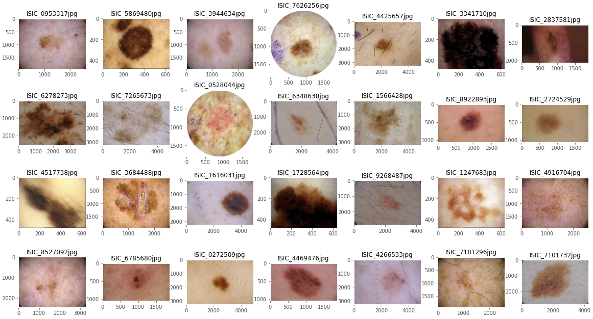

# Classifying Melanoma
**Tech Stack**: TensorFlow, Keras, Scikit-learn, TPU, GCS, Python  
**Algorithms**: Neural Network, EfficientNet, Focal Loss, SVM, Logistic Regression, PCA  

## Summary
The project is an attempt to compete in the [Kaggle competition](https://www.kaggle.com/c/siim-isic-melanoma-classification) using machine learning techniques to identify melanoma in images of skin lesions. The overall workflow is iterative with trials and errors:

A total of three neural networks and two baseline models are built:

- **Neural Networks**
  - v1. CNN Barebone, 3-Layer
  - v2. CNN Advanced, EfficientNet + Focal Loss
  - v3. CNN (for Image) + Neural Network (for Metadata)
- **Baseline Models**
  - Logistic Regression
  - Support Vector Machine

Lastly, an EDA (documented in a different [repository](https://github.com/yintrigue/portfolio-ds/tree/master/neural_net_visualization).) that explores ways to visualize EfficientNet B0 learns is performed. 

## Data

The training dataset consists of a total of **33,126 images (40+ GB)** and multiple metadata (including age, gender, and anatomy site), of which there are only **584 positive examples**. Three major challenges are presented by the dataset:

- Extreme class imbalance
- Missing meta entries
- Image inconsistency (e.g. hair, crop, zoom, aspect ratio, unexpected objects, etc. ), as demonstrated by the sample below.

A more detailed description on the issues and relative measures to address them in the project are described in the notebook, [`model_nn_v3_efn_meta.ipynb`](./model_nn_v3_efn_meta.ipynb). 

## Models

**Model v1** is a simple CNN with two hidden layers and dropouts. Minimal feature engineering and model fine-tuning was performed. The goal is to see how well a basic CNN can handle the Melanoma dataset. 

**Model v2** is built on EfficientNet with a number of key improvements:

- Model is built for training on **TPU**.
- **EfficientNet** B0 to B7 with transferred learning are experimented for fine-tuning the performance.
- **Focal Loss** is applied to address the issue of class imbalance in the dataset.
- A stronger **feature engineering** (including cropping, compression, and duplicate removal) is performed based on **EDA**.
- **K-Fold CV** is applied to test out different models and hyperparameters. 
- Two additional **baseline models** (Logistic Regression and SVM) are built as comparisons.  

**Model v3** combines the outputs from Model v2 (i.e. EfficientNet) with a second neural network specifically for metadata to produce the final predictions. 

Specifications for Model v3 are:

- **Feature Engineering (Images)**
  All images are cropped to squares with the same dimension. Random augmentation with the following adjustments (using TensorFlow's image library `tf.image`) are applied at runtime prior to entering the model for training or prediction.
- **Feature Engineering (Metadata)**
  - All data are transformed by one-hot. All missing values are given a value of -1. There are a total of 18 inputs after the one-hot transformation.
  - The strategy is based on the assumption that missing data are random by nature (i.e. no strong correlation to an example's class). By consistently assigning an unique value to missing data, the neural network should be able to learn the insignificance of the variable.
- **Convolutional Neural Network**
  The architecture of CNN stays exactly the same as Model v2. EfficientNet B0 is chosen in Model v3 simply for its efficiency for training.
- **Neural Netowrk for Metadata**
  Both hidden layers (highlighted in blue) consists of 64 neurons with relu activation and batch normalization. The dropout rate is set to 0.4. The specifications are chosen purely by experiment.
- **Dense Layer After Concatenation**
  The dense layer consists of 512 neurons with relu activation and batch normalization. The number of neurons is roughly half of the features after the concatenation.

In addition, Model v3 makes the final prediction by averaging the 50 probabilities (10 augmented variations x 5-folds) for each example in the test dataset.

## Results
### Baseline
Two baseline models, Logistic Regression (LR) and Support Vector Machine (SVM), are constructed. While both models achieve 97%+ accuracies with minimal effort of performance optimization, recall that a naive algorithm such as predicting all examples to be negative would easily achieve the same performance due to the imbalance in the dataset. The primary performance metric, AUC (Area Under Curve), also suffers in the baseline models. LR, for example, achieves a mere 0.52 AUC, essentially no better than the performance of a coin toss.

### Model v1

Model v1 produces poor results. AUC is close to 50 and the model is unable to identify any positive examples.

### Model v2  
Model v2 achieves an **AUC of 89.05** but there is sign of underfitting. Both training and validation data are believed to have room for improvement with more epochs of training. 

The setup that produces the best result is summarized below:
- Model: EfficientNet B7 
- Transferred Learning: ImageNet
- Loss Function: Focal Loss
- Epochs: 8
- Batch Size: 64
- Image Size: 256x256
- Random Image Augmentation: True

Note that the final model re-trained using the full 33,126 training examples prior to predicting the test data for submission to Kaggle. While re-training the model on the full dataset without validation can be uncommon in practice, it can be justified by the extreme rare positive examples in the dataset. The model benefits from learning the full 584 positive examples. A better approach, however, is to re-train the same best model using 5-folds, and use all 5 models for the final prediction. This method is adopted in Model v3.

The best model specified above achieves the following results:
- Kaggle Leaderboard Rank: 1,498 (out of 2,600+ entries)
- **AUC: 89.05**
- Sensitivity: 38.02 (estimated)

The result is considered reasonable given that the #1 ranking model from the 2019 competition achieves an AUC of ~0.95. I suspect that performance improvement beyond this point is only possible through ensemble.

### Model v3
Model v3 suffers from severe overfitting, so much so that the model is able to achieve a perfect AUC score despite the extreme poor results from the validation dataset. Potential fixes to improve the performance are discussed in the "Potential Improvements" section that follows.

Epoch 5:

|            | Training | Validation |
| ---------- | -------- | ---------- |
| **AUC**    | 1.00     | 0.71       |
| **Recall** | 100%     | 0.15%      |

## Potential Improvements
Model v2 and v3 suffer from different issues and require different treatments. Model v2 (underfitting) would benefit from additional training time (i.e. more epochs). Model v3 (overfitting), on the other hand, requires treatments such as a reduced complexity/scale of CNN as well as a stronger regularization. 

Ensemble that combines multiple models could help improve the performance in both cases. Other potential improvements include:      
- Additional Feature Engineering
    - Higher image resolution
    - Hair simulation (EDA shows that lesions are frequently covered by body hair)
    - Microscope vignette simulation (EDA shows that multiple images come with strong vignetting and/or round-shape cropping)
- Hyperparameters Fine-tuning
    - Gradient clipping
    - Learning rate decay
    - Grid search

## Repository 

- [`./model_nn_v3_efn_meta.ipynb`](./model_nn_v3_efn_meta.ipynb) contains all source codes and the final report write-up.
- [`./melanoma_ppt.pdf`](./melanoma_ppt.pdf) is a presentation that briefly discusses the various techniques used to build Model v3.
- `./archived_models` contains the notebooks for Model v1 and v2 with minimal write-up.
- `./_saves` contains the npy outputs and weights from the final model. 
- `./_img` contains the images used for the writeup and readme markdown.  
