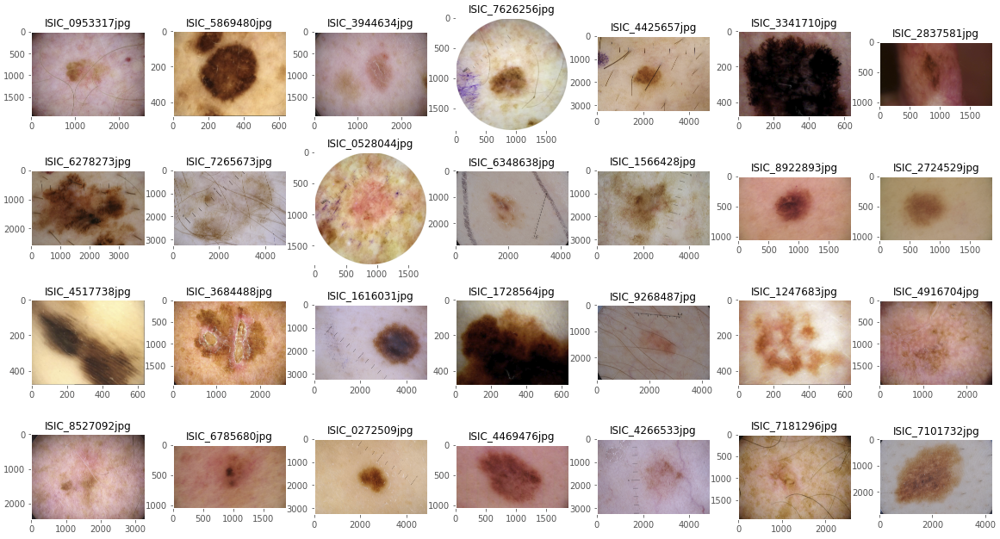

# Classifying Melanoma
**Tech Stack**: TensorFlow, Keras, Scikit-learn, TPU, GCS, Python  
**Algorithms**: Neural Network, EfficientNet, Focal Loss, SVM, Logistic Regression, PCA  

## Datasets

Two datasets are used for the classification: a CSV (~2MB) that contains patient metadata, and an image pool (40GB+) that consists of **33,126 skin lesion photos**, of which there are **only 584 positive examples**. Both datasets can be downloaded on Kaggle's competition page, [SIIM-ISIC Melanoma Classificatio](https://www.kaggle.com/c/siim-isic-melanoma-classification/data). A number of major challenges are presented by the two datasets:

- Extreme class imbalance, with only 1.76% of the examples being positive
- Raw data come with a large size (40GB+) in two distinct structures: images and text-based metadata
- Image inconsistency (e.g. hair, crop, zoom, aspect ratio, unexpected objects, etc. ), as demonstrated by the sample below.

