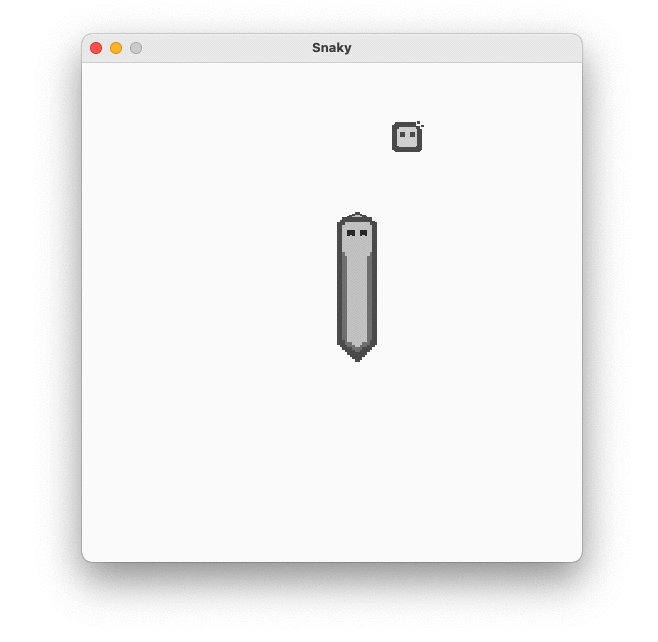
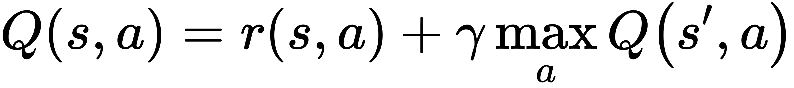
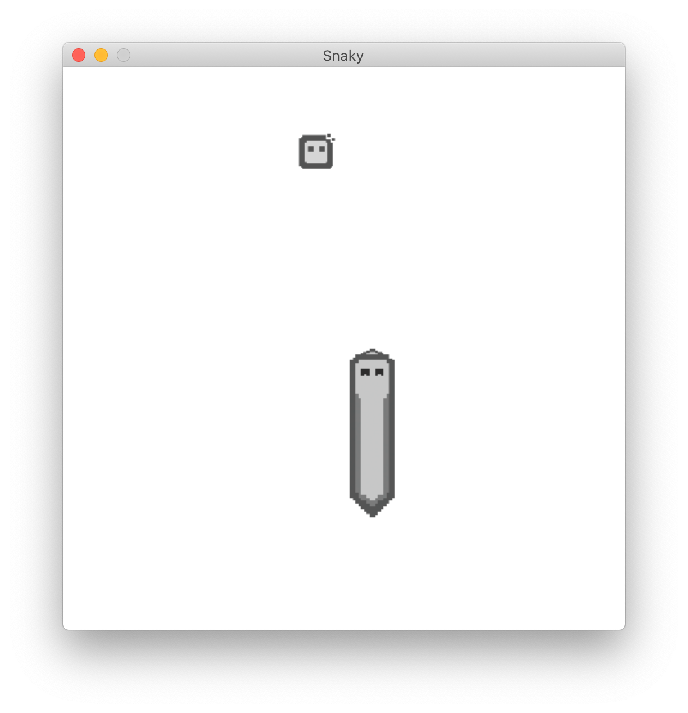
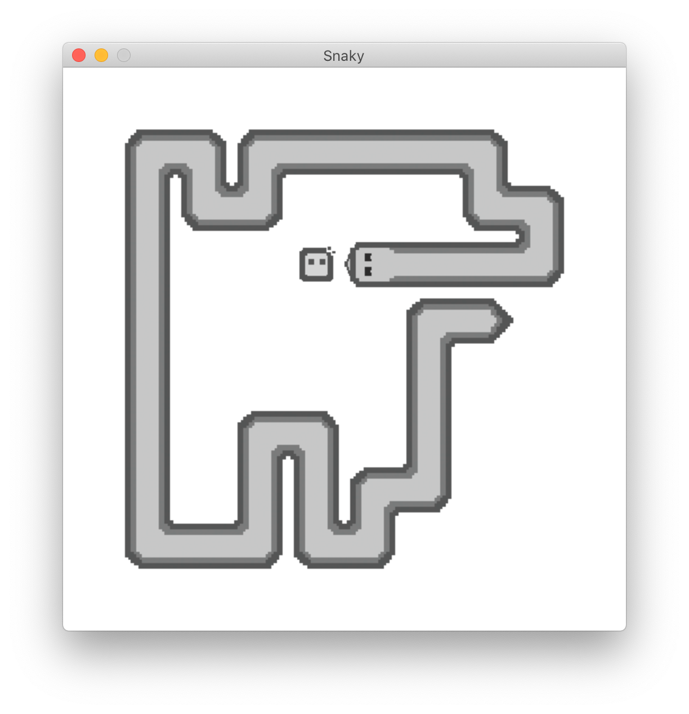
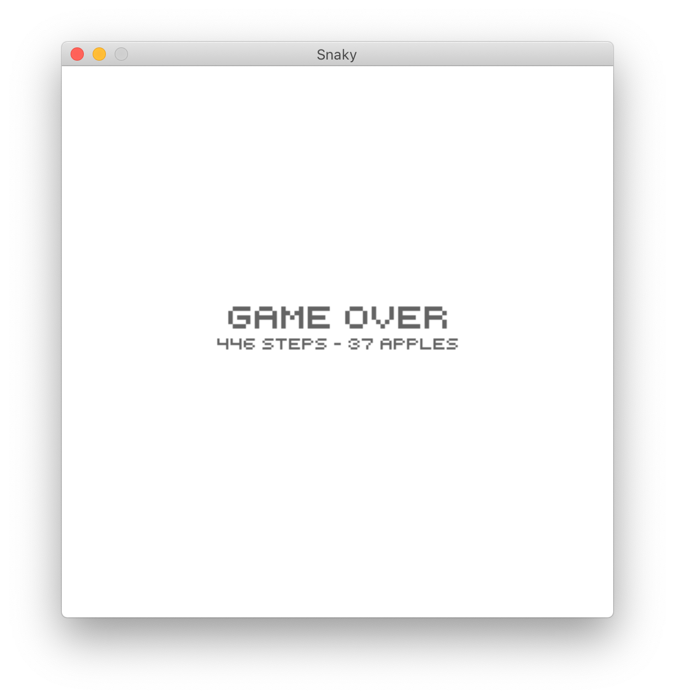

# Neural Snaky  
**Final Model**: Neural Network  
**Baseline Model**: Logistics  
**Tech Stack:** TensorFlow, Scikit-learn, PyGame  

## Overview
Neural Snaky is a PyGame implementation of the classic game, Snake. This is a fun **personal weekend project** that started as a simple game that I build for my 3 year old daughter. Then, I thought: Why don't I build a brain for the snake so that it can learns and plays the game by itself? The results is a Snake game with three modes:

- "**Play**" mode is nothing but a simple replicate of the classic game, Snake. The game is built using PyGame and the sprites can be easily customized for future updates. One key difference from the traditional Snake game is that the snake moves one step at a time per arrow key press. The design decision is to because my goal is to build something fun for my 3 year old daughter and help her improve hand-eye coordination.
- "**Autoplay**" gives the snake a brain to learn the game and play on its own.
- "**Replay**" mode replays the recorded game plays. Both Play and Autoplay modes can be recorded.

The game is built using OOP. Below is a simplified UML that shows select key properties and methods. `Snaky` is the tradition Snake game I build for my 3-year-old daughter while `SmartSnaky` is the Snake that is able to learns and plays itself.  

   

## Datasets

The training set is generated by "automatically" playing and recording the game (moves, results, visions, scores, etc.). The automatic play is achieved by making random moves (i.e. up, right, down, and left) until the snake hits an obstacle and die (i.e. a wall or the snake's own body). In addition, what the snake can see (i.e. its "vision") is recorded along each of the moves made by the snake. Depending on the chosen model as described in the Models section, the snake can see up to a total of three different objects: obstacle (i.e. a wall or a snake body), apple, and dead-end. An example of the snake's vision is:

| Obstacle | Apple | Dead-end |
| -------- | ----- | -------- |
| 1110     | 0110  | 0001     |

Each digit of the snake's vision represents what the snake can see in a certain direction. The four digits map to **up**, **right**, **down**, and **left** respectively. There are up to there objects the snake can see depending on the chosen model (as described in the Models section): obstacle, apple, and dead-end. 

- **Obstacle** indicates if a move in the chosen direction would hit an obstacle (i.e. a wall or a snake body). 
- **Apple** indicates if a move in the chosen direction would be closer to an apple. 
- **Dead-end** indicates if a move in the chosen direction would form a closed loop between the wall and the snake's body.

The **label** to be predicted depends on  the chosen model and what the snake can see. In Model 3, for example, where the snake is able to see obstacles and apples, the label is:

- 0 - Dead by hitting an obstacle 
- 1 - Live & closer to the apple
- 2 - Live & away from the apple

The snake determines its next step in the ascending order. That is: 2 is preferred over 1, and 1 is preferred over 0.

## Models

Four models are built as the "brains" that enable the snake to learn and play the game on its own:

- **Model 1**: Logistic Regression + Vision on Obstacles
- **Model 2**: Neural Net + Vision on Obstacles
- **Model 3**: Neural Net + Vision on Obstacles & Apples
- **Model 4**: Neural Net + Vision on Obstacles & Apples & Dead-ends

All neural nets come with two hidden layers (8x4) and ReLU as the activation, followed by a Softmax layer for classification. The challenges of the game are threefold:

- The model is required to make correct predictions "**continuously**." Any wrong prediction would result in the death of the snake. With a survival rate of 0.9, for example, the probability for the snake to live becomes 0.9^10=34.57% only after 10 moves.
- The snake should not only survive but also **score high** (i.e. by eating as many apples as possible).
- The model needs to learn the best strategy for the snake's **long-term survival**. 

The four models presented above are an attempt to solve the first two challenges. The third challenge requires different types of modeling and training strategies such as **reinforcement learning**, as discussed at the end of the results section.

## Results  

Model 1 and 2 are unable to "see" the apple. **Model 1** has an extremely poor survival rate. The snake with a logistic brain does not seem to be capable of learning the game. **Model 2**, on the other hand, learns the best strategy to survive by completely ignoring apples and running in a loop. 

The snake in **Model** 3 is given the ability to see if its next move would get closer to the apple. As a result, the snake now is able to not just survive but also play the game for "real" and score by eating apples. However, given its current vision, the snake is unable to see beyond its very first move. As a result, the snake constantly runs into a dead-end formed by the wall, the snake's body, or a combination of the two as the snake grows long after eating multiple apples.

Now to solve the problem of the snake forming closed loop as it grows long, my immediate intuition is to add new visions (**Model 4**) that would allow the snake to learn if its chosen next move would form a closed loop. However, it turns out that the geometric closed loop detection is not as straightforward as I think it would be. In fact, neural network alone is probably **NOT even a good idea** for solving the snake game because the snake is unable to learn how to improve its game score (i.e. optimizing on how many apples the snake can eat in a game). 

A better plan for the next phase of the training, instead, is to explore **deep Q reinforcement learning** which would allow me to optimize the snake's learning against the longterm rewards instead of just the survival in the very next step using the Bellman Equation:  

## Gameplay Screenshots

## Repository 

- [`./src`](./src) includes all source codes.
- [`./src/demo.py`](./src/demo.py) is a simple demo of the game. To run the game, simply enter `python demo.py` in the terminal.
- `./models` includes the trained weights of the three models described in the Models section.  
- `./data/train.csv` is a sample of the training set generated by the random autoplay.
- `./data/autoplay.csv` is a sample record of the game played by Model 3.
- `./assets` includes sprites and font used for the game.
- `./img` includes images used for the readme markdown.  

