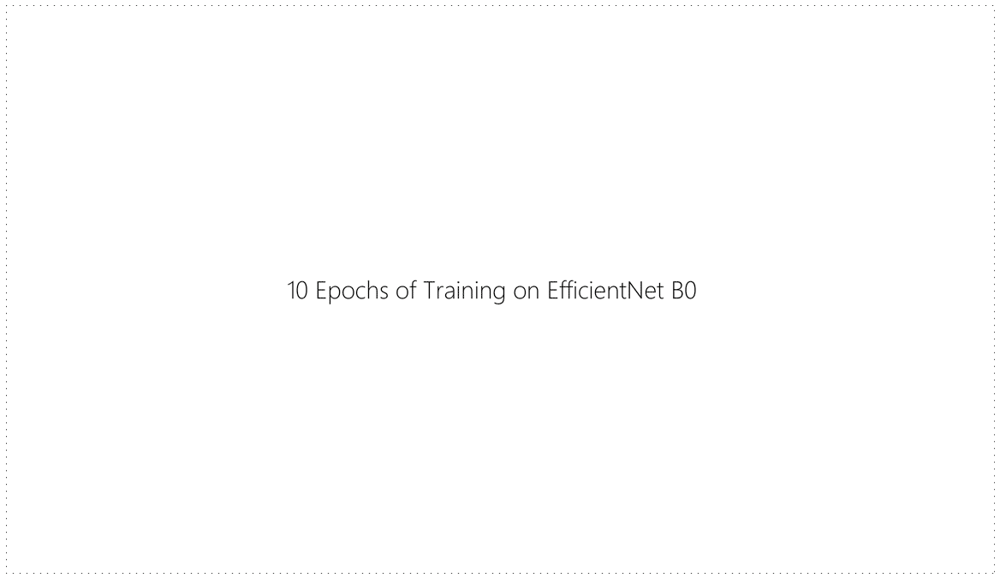

# Neural Net Visualization  
**v1.0.1**

**Tech Stack**: Convolutional Neural Network, Principle Component Analysis (PCA), EfficientNet, Focal Loss, Keras, TensorFlow

## Description
The project explores ways to visualize the learning progress of EfficientNet-B0, a convolutional neural network published by Google in 2019. The training dataset consists of a total of **33,126 images**, of which there are only **584 positive examples**. More information about the dataset can be found on the  [homepage](https://www.kaggle.com/c/siim-isic-melanoma-classification/overview) of Kaggle's competition, *SIIM-ISIC Melanoma Classification*.

## Methodology

Embeddings from EfficientNet-B0 are extracted and projected onto a 2D plane using PCA prior to entering the dense layer with sigmoid activation. The PCA-reduced 2D plane is then plotted and images close to each other (by Euclidean Distance) within the same region are rendered for examination. 

## Results

Clusters start to form with just one epoch of training on Efficient-B0. The separation between the Benign and Melanoma examples starts roughly from the 6th epoch.

In addition, images close to each other at the end of the first epoch of training strongly resemble to each other visually. 

By the end of the 10th epoch, however, images close to each other after PCA no longer look similar even when examples are correctly classified by EfficientNet-B0. Why? My hypothesis is that with 10 epochs of training, EfficientNet-B0 is now picking up subtitle details that can no longer be understood by my untrained eyes. Wow! EfficientNet-B0 is on its way to become an expert on diagnosing Melanoma!

## Screenshots

## Repository 

- `demo.ipynb` is a simple demo on how to run the game.
- `./src` stores the game's source codes in two different modules.
- `./assets` stores the sprites and font used for the game.
- `./img` stores the images used for the readme markdown.  

