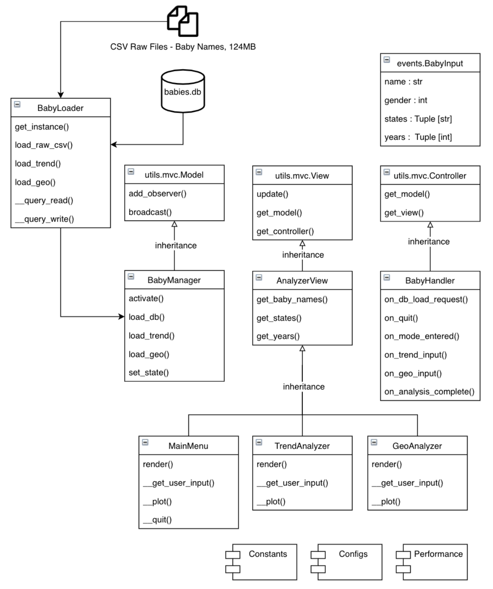
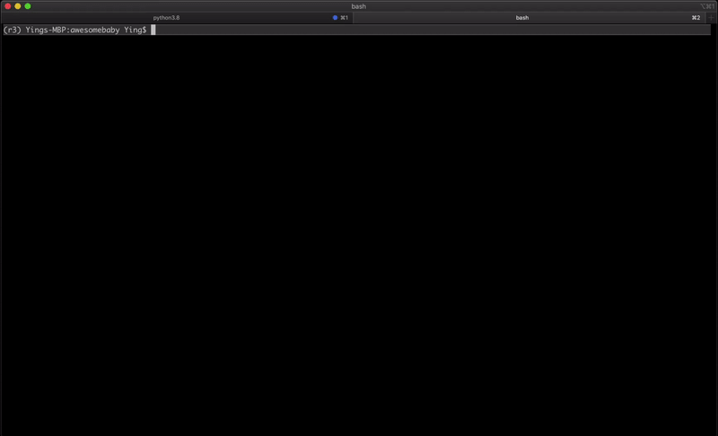
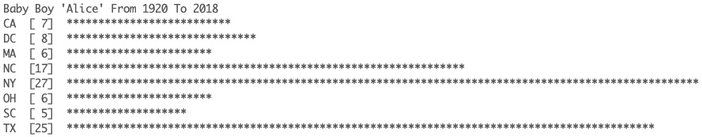
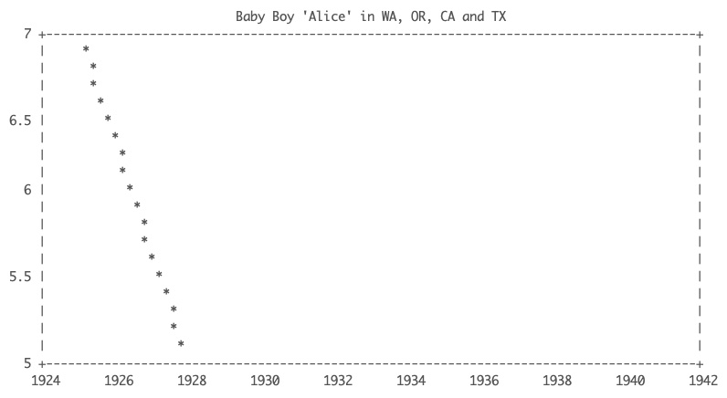

# AwesomeBabyNames

**v1.0.3**

**Tech Stack:** MVC, SQLite, Python

An awesome baby starts with an awesome name! Coming up with a great name for the cute little one is tough. Internet is full of suggestions based on “expert opinions,” but we can now do better with the power of data. Do you have a newborn coming without a name? Fear not, for *AwesomeBabyNames* is here to help, with **over 100 years of census data** collected by the US government (~124MB).

*AwesomeBabyNames* is a Python terminal program built using a number of **design patterns** including Service Locator and MVC (Model-View-Controller). The code base for the **MVC framework** can be found in the  mvc module at `/src/abn/utils/mvc.py`. A simplified UML with select key classes, methods, and properties is shown below:

<p align="center"></p>

## Demo

*AwesomeBabyNames* is a terminal-based Python program designed to help parents analyze 100+ years of census data collected by the US government. The dataset includes all newborns’ names registered in the US from 1910 to 2018.    

To run AwesomeBabyNames*, simply run:

```bash
>> python src/main.py
```



Still don't have an idea for the baby's name? Here's a fun one for you to start with: Enter "Alice" and observe how people actually use the name for both baby girls and boys!





## Repository

- `requirements.txt` contains a list of the required third-party packages.  
- `./data/` contains the raw csv files from data.gov.
- `./ src/` contains the source codes for *AwesomeBabyNames*, including the program main,  `src/main.py`.
- `./doc/en/abn_doc.pdf` is a simple technical report that documents the architecture of *AwesomeBabyNames*.