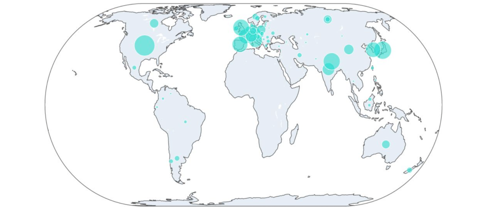

# Death-Zone Mountaineering  
**Tech Stack:** Plotly, Seaborn, PyWaffle, GeoPy, Pandas, NumPy  
**Analysis Write-up:** [`./docs/research_report_eight-thousanders.pdf`](./docs/research_report_eight-thousanders.pdf)

## Description
*Death-Zone Mountaineering* is an analytics research the explores the expeditions to 16 eight-thousander peaks (i.e. peaks with altitudes above 8,000m where the amount of oxygen is insufficient to sustain human life for an extended time span) in the Himalayas mountain range. The three primary research questions are:

- Who are the people willing to risk their life venturing into the death zone?
- How do mountaineers’ eight-thousander peak preferences change over time?
- What makes climbing eight-thousanders risky?  

## Data

The research is primarily based on the [Himalayan Database](https://www.himalayandatabase.com/) covering **100+ years of expeditions from 1905 to 2019**. The datase is best described by the creator’s own words:

> The Himalayan Database is a compilation of records for all expeditions [from 1905 through Spring 2019] that have climbed in the Nepal Himalaya. The database is based on the expedition archives of Elizabeth Hawley, a longtime journalist based in Kathmandu, and it is supplemented by information gathered from books, alpine journals and correspondence with Himalayan climbers.

A total of five datasets are included in the Himalayan Database:
| Dataset              | Description                                                  |
| -------------------- | ------------------------------------------------------------ |
| Peaks                | Data of all peaks in the Himalayas                           |
| Expeditions          | Data of all expeditions between 1905 and 2019                |
| Members              | Data of members of each expedition between 1905 and 2019     |
| Expeditions Analysis | Calculated expedition analytics based on the Expeditions dataset |
| References           | References used for constructing the Himalayan Database      |

A copy of the exported raw data and documentation is included in the repository at `./data`.

## Select Findings
Select findings from the analysis are presented in this section. Please refer to the PDF at [`./docs/research_report_eight-thousanders.pdf`](./docs/research_report_eight-thousanders.pdf) for the full write-up.  

### First Ascents

All eight-thousander peaks opened to public with permits have been climbed over the past 70 years. In particular, Mount Everest was first ascended by Edmund Hillary and Tenzing Norgay on May 29, 1953, which was considered one of the greatest accomplishments in mountaineering given the lack of modern climbing equipment and logistics operations available at the time. 

Figure: First Ascent by Peak Timeline

### Homes of the Daredevils

Europe is the origin of mountaineering. Our research, however, shows that in addition to Europe, a large number of eight-thousander climbers come from developed countries including Japan, Korea, and the US, lilkely reflecting the high costs associated with the expeditions.

Figure: Eight-Thousander Climbers’ Home Countries (1905-2019)

### Rise of Girl Power

Mountaineering has historically been dominated by men: Only 1 out of 10 climbers were female between 1905 and 2019. 

Figure: Male vs. Female Climbers (1905-2019)&nbsp;&nbsp;&nbsp;&nbsp;&nbsp;&nbsp;&nbsp;&nbsp;&nbsp;&nbsp;&nbsp;&nbsp;&nbsp;&nbsp;&nbsp;&nbsp;&nbsp;&nbsp;&nbsp;&nbsp;&nbsp;&nbsp;&nbsp;&nbsp;&nbsp;&nbsp;&nbsp;&nbsp;&nbsp;&nbsp;  

 
However, there has been a rapid growth of female climbers since 1980. In fact, the youngest climber to ascend Mount Everest is Malavath Pooma, a 13 year-old female climber!

Figure: Number of Female Climbers by Year

### Experience Matters

One surprising finding is that even though CHOY is generally believed to be the easiest peak to ascend among the 16 peaks studied in the research, it actually comes with failure and death rates on par with Mount Everest. One explanation can be attributed to the lack of experience because CHOY is mostly climbed by relatively inexperienced climbers. The finding echoes the importance of skills and experience when climbing into the death zone.

Figure: Failure Rate vs. Death Rate (1905-2019)

### The Real Death Zone on Mount Everest

While the death rate peaks in the death zone on Mount Everest above 8,000 meters, there is an unexpected surge of death incidents between 5,000m and 6,000m. Further investigation reveals that Khumbu Icefall, one of the most deadly stages of the South Col route to Everest's summit, is located at 5,486 metres.

Figure: Deathby Altitude Distributions (1905-2019)

### Too Tired to Climb Down?

If you admire for those who venture into the death zone, you might be in awe of those who choose not to “walk” down from the summit. Will you be the next daredevil?

Figure: When Climbing Down Is Way Too Much Work... (1905-2019)

## Repository 

- Notebooks:
  - `peaks.ipynb` includes the analysis of the 16 eight-thousander peaks in the in the Himalayas.
  - `members.ipynb` includes the analysis of the eight-thousander climbers between 1905 and 2019
  - `expeditions.ipynb` includes the analysis of the eight-thousander expeditions between 1905 and 2019
- `./lib` includes additional Python modules used for the analysis.
- `./data` includes the exported raw data and documentation from the Himalayan Database.
- [`./docs/research_report_eight-thousanders.pdf`](./docs/research_report_eight-thousanders.pdf) is the final write-up for the research.  

