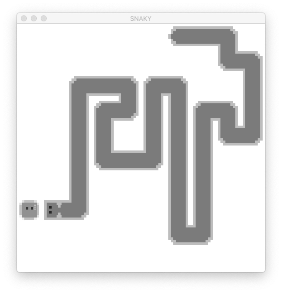
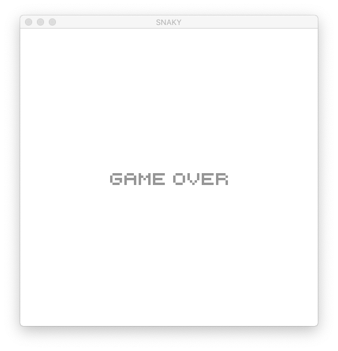

# Snaky  
**Tech Stack:** PyGame, Python

## Description
Snaky is a PyGame implementation of the classic game, Snake. The goal is not to develop a fully playable game, but rather an implementation specifically for training in neural network. Key features include:
- Option to save and replay history stored in CSV
- Dimension and resolution of the game board are adjustable, which enables experiments in neural network
- Customizable sprites & OOP for ease of future extension

Here is a simplified UML with select key properties and methods:  

## Screenshots

## Repository 

- `demo.ipynb` is a simple demo on how to run the game.
- `./src` stores the game's source codes in two different modules.
- `./assets` stores the sprites and font used for the game.
- `./img` stores the images used for the readme markdown.  

