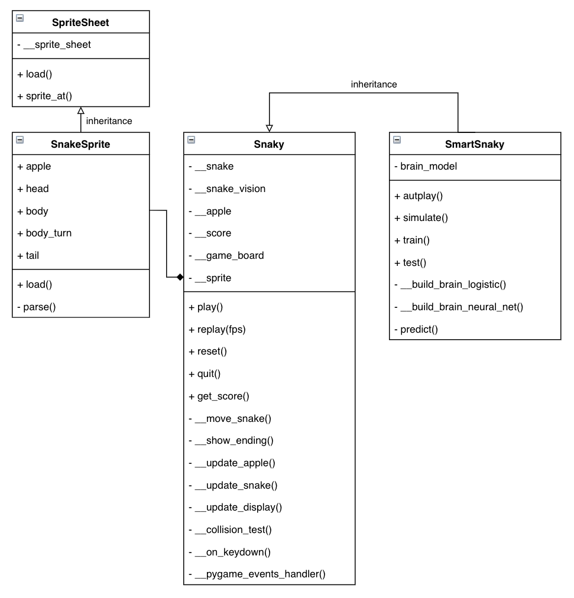

# Snaky  
**Tech Stack:** PyGame, Keras, TensorFlow, Scikit-learn, Python

## Description
Snaky is a PyGame implementation of the classic game, Snake. The goal is not to develop the full game but an implementation specifically for machine learning. A detailed description on the ML aspects of the project can be found under the ML section of the portfolio.

Key features include:

- Play manually or auto play using a brain (logistic regression & neural net)
- Option to save and replay game play
- Adjustable resolution and frame rate
- Fully customizable sprites & OOP for ease of extension

Here is a simplified UML that shows select key properties and methods:  

## Screenshots

## Repository 
- `[demo.ipynb](demo.ipynb)` is a simple demo of the game.
- `train.csv` is the play history data generated for ML training.
- `brain.h5` is the model for the snake's brain (i.e. saved model weights from Keras).
- `./src` includes all source codes.
- `./assets` includes sprites and font used for the game.
- `./img` includes images used for the readme markdown.  

