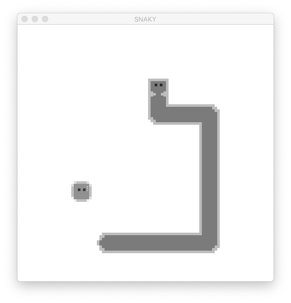
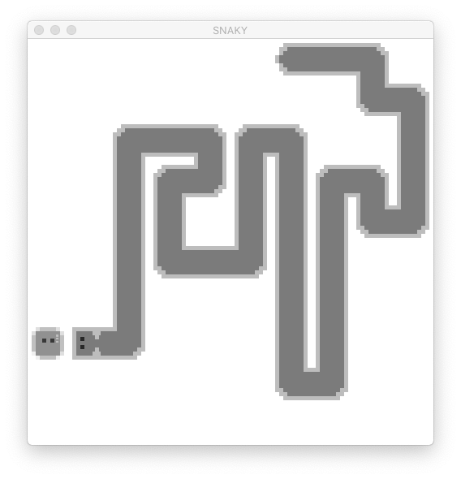
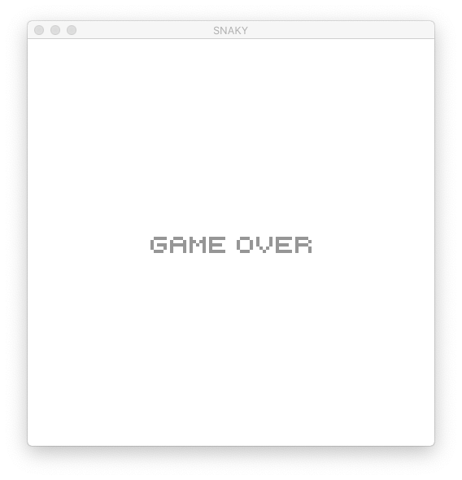

# Snaky
Tech Stack: PyGame, Python

## Description
Snaky a simplified implementation of the classic Snake game using PyGame. The goal is not to develop a fully playable game, but rather a basic implementation for training in neural network.  Key features include:
- Option to save history to CSV 
- Option to reply by taking commands from CSV 
- Customizable sprites & full OOP for ease of future extension

Repository structure:  
- `demo.ipynb` is a demo on how to run the game.
- `./src` stores all source codes.
- `./assets` stores all sprites and font used for the game.

## Screenshots

